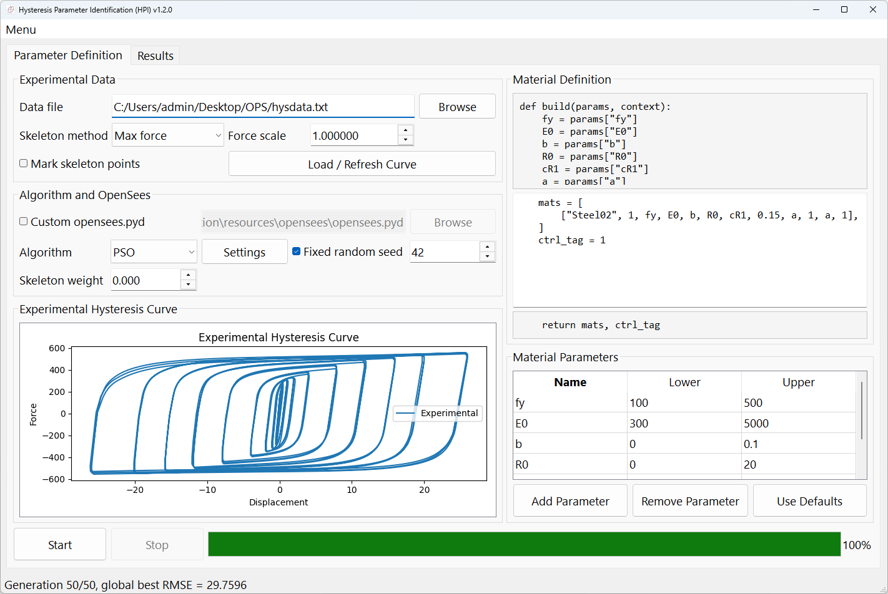
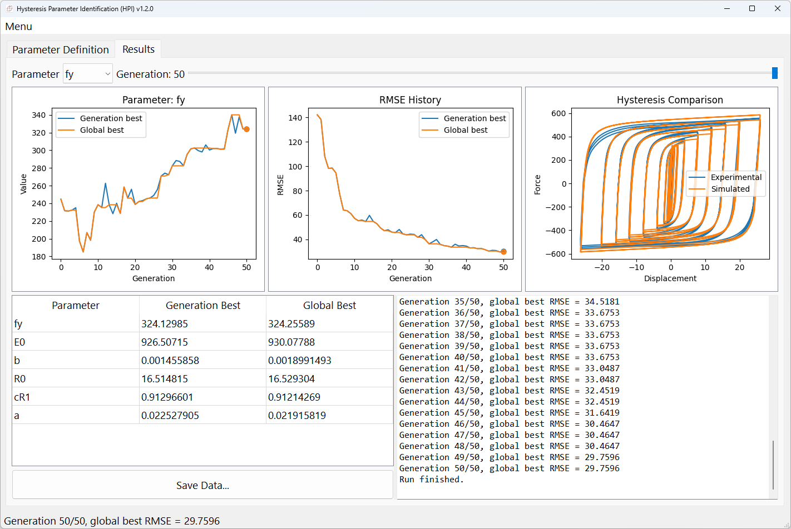
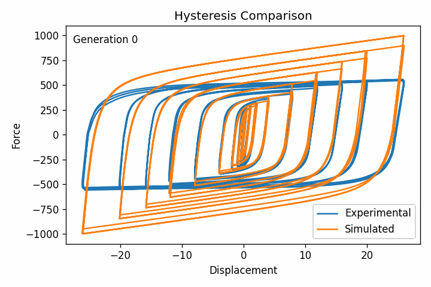

# Hysteresis Parameter Identification (HPI)

PyQt5 desktop application for identifying OpenSees uniaxial material parameters from an experimental hysteresis curve.

## Screenshots

### Parameter Definition

Configure the experimental data, optimization algorithm, OpenSees material script, and parameter bounds in the Parameter Definition tab.



### Identification Results

Inspect parameter histories, RMSE convergence, the experimental/simulated hysteresis comparison, and the identified parameter values in the Results tab.



### Hysteresis Evolution

The exported animation shows how the simulated hysteresis curve converges toward the experimental curve across optimization generations.



## Run

```powershell
python .\main.py
```

The application uses the built-in module by default:

```text
resources\opensees\opensees.pyd
```

Enable `Custom opensees.pyd` in the UI only when you want to choose another OpenSees Python module. The built-in `.pyd` supports Python 3.14. `OpenSees.exe` is not supported.

## UI Conversion

```powershell
.\scripts\compile_ui.ps1
```

## Nuitka Build

```powershell
.\scripts\build_nuitka.ps1
```

The build script creates a no-console Windows GUI executable with Nuitka onefile mode. It includes the built-in `opensees.pyd`, `libiomp5md.dll`, icons, and user guides.

## Material Script

Only the middle script body is editable. The application generates the fixed wrapper from the parameter table:

```python
def build(params, context):
    fy = params["fy"]
    E0 = params["E0"]
    b = params["b"]
    # editable body starts here
    mats = [
        ["Steel01", 1, fy, E0, b],
    ]
    ctrl_tag = 1
    # editable body ends here
    return mats, ctrl_tag
```

The editable body may define multiple OpenSees materials and return the control material tag. This replaces the previous multi-material UI.

## Export

Use `Save Data...` after a run to export:

- parameter definitions as JSON
- final identified parameters as JSON
- run log
- experimental hysteresis plot
- hysteresis comparison plot
- RMSE history plot
- one parameter-history plot for each parameter
- hysteresis comparison GIF across generations

See [User Guide](docs/user_guide.md) for detailed usage.
